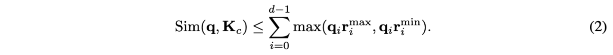

**Environment:**

We use the Secretflow framework with SPU to evaluate the decoding efficiency. The SPU version is 0.9.1.dev. We mainly focus on the 3-party computation (3PC)-based inference.
Following Secretflow, we use `bazel` to install and build the framework. 
To clearly profile the overhead of each module, we evaluate operator-level cost to obtain a detailed breakdown.

* Framework: SecretFlow
* Python version: 3.10
* SPU version: 0.9.1.dev
* MPC Setting: 3PC (three-party computation)
* Build Tool: Bazel (configs in BUILD.bazel)

Before starting, make sure you have installed and built SecretFlow with Bazel.

**Setups:**

1. Network initialization: run the following script to configure the network:
```bash
bash throttle.sh lan
```

2. Launch the SPU cluster: use `nodectl` to bring up the nodes based on the configuration file:
```bash
bazel run -c opt //examples/python/utils:nodectl -- --config `pwd`/path/3pc.json up
```

3. Start the inference:
```bash
bazel run -c opt //examples/python/ml/project_path -- --config `pwd`/path/3pc.json
```

`generation_evaluation.py` is used to evaluate the model inference with KV cache. `operator_evaluation.py` is used to evaluated every part of extra costs introduced by `similarity approximation, top-k ranking, and token gathering (idx2onehot and onehot_k_gemv)`.
The core algorithm of similarity approximation is shown below:




`rank.cc` is the optimized version of top-k protocol in SPU framework, which parallelizes the attention head dimension to avoid the latency overhead caused by sequential computation.